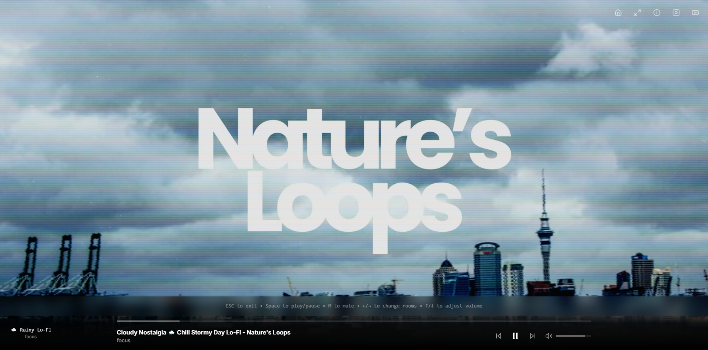

# Nature's Loops

Nature's Loops is a Next.js web application that provides a beautiful interface for exploring lo-fi music inspired by nature. Perfect for relaxation, focus, and meditation.



## 🔥 Features

- **Responsive Design**: Beautiful UI that works on mobile and desktop
- **Modern Interface**: Clean, intuitive user interface with smooth animations
- **Social Integration**: Easy access to YouTube and Instagram channels
- **Component Library**: Built with shadcn/ui components for a consistent design language

## 🚀 Technology Stack

- **Framework**: [Next.js 14](https://nextjs.org/)
- **Language**: [TypeScript](https://www.typescriptlang.org/)
- **Styling**: [Tailwind CSS](https://tailwindcss.com/)
- **UI Components**: [shadcn/ui](https://ui.shadcn.com/)
- **Animations**: [Framer Motion](https://www.framer.com/motion/)
- **Icons**: [Lucide React](https://lucide.dev/)
- **Database**: [MongoDB](https://www.mongodb.com/)
- **Form Handling**: [React Hook Form](https://react-hook-form.com/) with [Zod](https://github.com/colinhacks/zod)
- **Date Handling**: [date-fns](https://date-fns.org/)
- **Carousel**: [Embla Carousel](https://www.embla-carousel.com/)
- **Toast Notifications**: [Sonner](https://sonner.emilkowal.ski/)

## 📦 Installation

### Prerequisites

- Node.js (v18 or higher)
- npm or yarn
- Git

### Setup

1. Clone the repository
   ```bash
   git clone https://github.com/Cadogy/natures-loops.git
   cd natures-loops
   ```

2. Install dependencies
   ```bash
   npm install
   # or
   yarn install
   ```

3. Set up environment variables
   ```bash
   cp .env.example .env.local
   ```
   Then, edit `.env.local` with your configuration values.

4. Run the development server
   ```bash
   npm run dev
   # or
   yarn dev
   ```

5. Open [http://localhost:3000](http://localhost:3000) with your browser to see the result.

## 📚 Usage

Nature's Loops provides a simple interface for users to:

- Browse through curated music collections
- Connect with the community through social links
- Experience a visually pleasing UI tailored to enhance the listening experience

## 🎮 Development

### Directory Structure

```
natures-loops/
├── app/                  # Next.js App Router
│   ├── layout.tsx        # Root layout
│   ├── page.tsx          # Home page
│   └── globals.css       # Global styles
├── components/           # UI components
│   └── ui/               # shadcn/ui components
├── hooks/                # Custom React hooks
├── lib/                  # Utility functions
├── public/               # Static assets
│   └── images/           # Image files
└── ...                   # Configuration files
```

### Available Scripts

- `npm run dev` - Run development server
- `npm run build` - Build for production
- `npm run start` - Start production server
- `npm run lint` - Run ESLint

## 🤝 Contributing

Contributions are welcome! Please feel free to submit a Pull Request.

1. Fork the repository
2. Create your feature branch (`git checkout -b feature/amazing-feature`)
3. Commit your changes (`git commit -m 'Add some amazing feature'`)
4. Push to the branch (`git push origin feature/amazing-feature`)
5. Open a Pull Request

## 📝 License

Distributed under the MIT License. See `LICENSE` for more information.

## 📧 Contact

Project Link: [https://github.com/Cadogy/natures-loops](https://github.com/Cadogy/natures-loops)

## 🙏 Acknowledgements

- [Next.js](https://nextjs.org/)
- [shadcn/ui](https://ui.shadcn.com/)
- [Tailwind CSS](https://tailwindcss.com/)
- [Radix UI](https://radix-ui.com/)
- [Lucide Icons](https://lucide.dev/) 